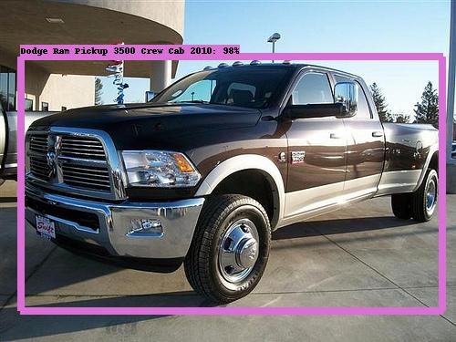

# TensorFlow Object Detection API for Stanford Cars

Use Google's TensorFlow Object Detection API [0] to detect 196 vehicles types in the Stanford Cars dataset [1]. 

## Getting Started

Download the Stanford Cars dataset.

```
http://imagenet.stanford.edu/internal/car196/car_ims.tgz
```

Unzip the tgz file to your data folder. 
```
tar -xzvf car_ims.tgz -C <data folder>
```

Clone this repo.
```
$ git clone https://github.com/deanwetherby/tf_oda_stanford_cars
```

Create the train and test tfrecords from the Stanford Cars annotations. Their train/test split is about 50/50. In the future, I'd like to change the scripts to use more of an 80/10/10 split instead but it's ok for now. You can create the label map using the script but the labels file is already provided for you. 

I use a Python virtual environment called 'tf' which is short for TensorFlow. If you need help setting up a virtual environment, I suggest you visit Adrian Rosebrock's website called pyimagesearch.com [2].


```
$ cd tf_oda_stanford_cars
$ workon tf
(tf) $ python create_stanford_cars_tf_record.py --data_dir=<data folder> --set=train --output_path=stanford_cars_train.tfrecord
(tf) $ python create_stanford_cars_tf_record.py --data_dir=<data folder> --set=test --output_path=stanford_cars_test.tfrecord
(tf) $ python create_stanford_cars_label_map.py
```

(Optional) Test the creation of tfrecords by dumping the data to a folder. The filename is currently hard-coded in the python script so if you want to dump train or test, you'll have to modify the file.
```
(tf) $ python dump.py
```
### Download pretrained model

Download a pretrained model from the model zoo [3] and untar to your models folder. I used SSD MobileNet v2.

### Modify the pipeline configuration file

Change the number of classes in the pipeline.config to 196 to match the number of classes in Stanford Cars and update paths to your fine tune checkpoint and labels file for both train and eval.

## Train

```
(tf) $ python ~/workspace/models/research/object_detection/model_main.py --pipeline_config_path=./models/ssd_mobilenet_v2_coco_2018_03_29/pipeline.config --model_dir=output --num_train_steps=100000 --num_eval_steps=1000
```

## Evaluation

There's no eval.py script in the new version of the Object Detection API. So we will convert the checkpoint to a pb file and run prediction on a few example images.

### Convert checkpoint to pb file

```
(tf) $ python -u ~/workspace/models/research/object_detection/export_inference_graph.py --input_type=image_tensor --pipeline_config_path=./models/ssd_mobilenet_v2_coco_2018_03_29/pipeline.config --trained_checkpoint_prefix=output/model.ckpt-100000 --output_directory=./stanford_cars_inference_graph/
```

The predict script uses hard-coded paths so you'll have to modify for your needs. The script samples 60 images randomly from the data folder and outputs the image detections in the markups folder.

```
(tf) $ python predict_image.py 
```

Here are a few images with detection.





## To Do

Continue improving model training.
Clean up scripts to remove hard-coded paths.

## References

```
[0] TensorFlow Object Detection API, https://github.com/tensorflow/models/tree/master/research/object_detection
[1] Stanford Cars, https://ai.stanford.edu/~jkrause/cars/car_dataset.html
[2] PyImageSearch Virtual Environments, https://www.pyimagesearch.com/2017/09/27/setting-up-ubuntu-16-04-cuda-gpu-for-deep-learning-with-python/
[3] Model Zoo, https://github.com/tensorflow/models/blob/master/research/object_detection/g3doc/detection_model_zoo.md
```

